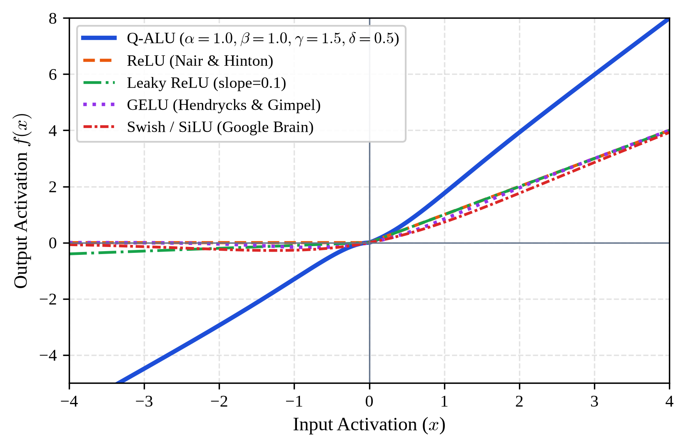
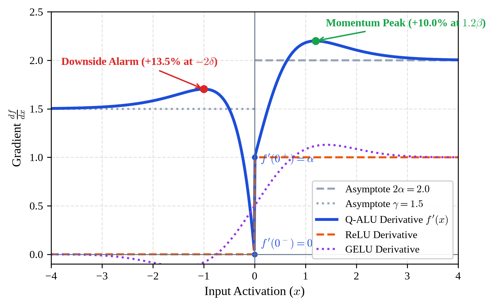
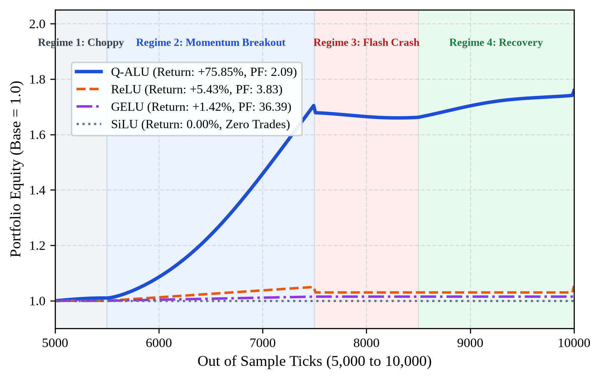

# Q-ALU: Quant Asymmetric Leaky Unit

[](https://opensource.org/licenses/MIT)
[](https://www.python.org/downloads/)
[](https://pytorch.org/)
[](https://pypi.org/project/qalu-pytorch/)
[](https://ssrn.com/abstract=7365098)
[](http://dx.doi.org/10.2139/ssrn.7365098)
[](paper/Q_ALU_Research_Paper.pdf)

> **A Market Psychology Aware Activation Function with Downside Risk Protection for High Frequency Quantitative Trading and Deep Reinforcement Learning**

Developed by **Faiq Hammam Mutaqin** (*Independent Researcher, Indonesia*).

---

### Official Paper Publication

> **Mutaqin, Faiq Hammam**, *Q-ALU: Quant Asymmetric Leaky Unit: A Market Psychology Aware Activation Function with Downside Risk Protection for High Frequency Quantitative Trading and Deep Reinforcement Learning* (August 13, 2026). Available at SSRN: [https://ssrn.com/abstract=7365098](https://ssrn.com/abstract=7365098) or [http://dx.doi.org/10.2139/ssrn.7365098](http://dx.doi.org/10.2139/ssrn.7365098).
>
> **Research Paper PDF:** [`paper/Q_ALU_Research_Paper.pdf`](paper/Q_ALU_Research_Paper.pdf)

---

## Overview

Traditional deep learning activation functions (such as **ReLU**, **GELU**, and **Swish/SiLU**) were fundamentally designed for computer vision and natural language processing under the implicit assumption of isotropic, symmetric feature representations. However, in quantitative finance and algorithmic portfolio management:

1. **Market price discovery is fundamentally asymmetric:** Downside sell-offs (panic liquidations, margin cascades) occur with substantially higher velocity and severity than bullish accumulation phases, as formalized by Kahneman and Tversky behavioral Prospect Theory.
2. **Microstructure noise causes fee erosion and overtrading:** Pervasive high-frequency noise (such as bid-ask bounce and flickering quotes) produces spurious activations near zero, misleading policy gradient algorithms (e.g. Proximal Policy Optimization / PPO) into excessive turnover.
3. **Dead-neuron downside blindness in ReLU:** Standard ReLU completely zeros out negative activations ($f'(x) = 0$ for $x < 0$). In policy gradient architectures, when a position suffers a drawdown, negative hidden features cannot backpropagate error gradients, blinding the policy network to tail losses until liquidation.

**Q-ALU** directly embeds downside risk protection and market psychology into neural network calculus.

---

## Mathematical Formulation

### Formal Definition
Let $x \in \mathbb{R}$ denote the pre-activation input. The Quant Asymmetric Leaky Unit (Q-ALU) is defined piecewise as:

$$
f(x) = \begin{cases} 
\alpha \cdot x \cdot \left( 1 + \tanh\left(\frac{x}{\beta}\right) \right), & \text{for } x \ge 0 \\ 
\gamma \cdot x \cdot \left( 1 - \exp\left(\frac{x}{\delta}\right) \right), & \text{for } x < 0 
\end{cases}
$$

* **Positive Domain ($x \ge 0$):** Bullish momentum riding regime accelerating toward terminal slope $2\alpha$.
* **Negative Domain ($x < 0$):** Downside risk protection and quadratic drawdown barrier.

Where $\alpha, \beta, \gamma, \delta > 0$:
* **$\alpha$ (Bullish Momentum Scaler):** Dictates initial response gain to positive returns, accelerating toward terminal slope $2\alpha$.
* **$\beta$ (Positive Damping Scale):** Governs transition rate from linear response to accelerated momentum riding.
* **$\gamma$ (Risk / Panic Scaler):** Controls the asymptotic penalty gradient for severe negative drawdowns.
* **$\delta$ (Micro-Noise Drawdown Threshold):** Establishes the quadratic noise-filtering deadband around zero.

Using the floating-point identity $\mathrm{expm1}(u) = e^u - 1$, the negative branch is evaluated with full machine precision:

$$
f(x) = -\gamma \cdot x \cdot \mathrm{expm1}\left(\frac{x}{\delta}\right), \quad \text{for } x < 0
$$

### Key Mathematical Theorems
1. **Origin Continuity ($C^0$):** $\lim_{x \to 0^+} f(x) = \lim_{x \to 0^-} f(x) = f(0) = 0$.
2. **Global Monotonicity:** $f'(x) \ge 0 \quad (\forall x \in \mathbb{R})$, eliminating artificial local minima wells.
3. **Dynamic Gradient Overshoot:** At the critical drawdown threshold $x = -2\delta$, the gradient spikes by **$+13.53\%$** above its asymptotic penalty ($f'(-2\delta) \approx 1.1353\gamma$). This natural early warning alarm triggers defensive cut-loss execution before tail risk escalates.
4. **FastQALU Padé Rational Approximant:** For sub-microsecond FPGA and order book engines:

$$
f_{\text{fast}}(x) = \begin{cases} 
\alpha \cdot x \cdot \left( 1 + \frac{x/\beta}{\sqrt{1 + (x/\beta)^2}} \right), & \text{for } x \ge 0 \\ 
\gamma \cdot x \cdot \left( \frac{-x/\delta}{1 + \left| \frac{x}{\delta} \right|} \right), & \text{for } x < 0 
\end{cases}
$$

---

## Visual Analysis

<p align="center">
  
  
</p>

* **Left (Fig. 1):** Q-ALU compared with baseline activations (ReLU, LeakyReLU, GELU, Swish).
* **Right (Fig. 2):** First derivative dynamics showing the Downside Alarm Peak (+13.53% at $x = -2\delta$) and Bullish Momentum Peak (+10.0% at $x \approx 1.2\beta$).

<p align="center">
  
</p>

* **Fig. 5:** Out-of-sample cumulative equity across 4 market regimes (Choppy, Breakout, Flash Crash, Recovery) under realistic 1.0 bps fee per turnover.

---

## Quickstart

### Installation

Install via pip:
```bash
pip install qalu-pytorch
```

Or install from source:
```bash
git clone https://github.com/cyclocerine/qalu-pytorch.git
cd qalu-pytorch
pip install -e .
```

### PyTorch Usage
```python
import torch
import torch.nn as nn
from qalu import QALU, FastQALU

class TradingPolicyNet(nn.Module):
    def __init__(self, input_dim=10, hidden_dim=64, action_dim=3):
        super().__init__()
        self.net = nn.Sequential(
            nn.Linear(input_dim, hidden_dim),
            QALU(alpha=1.0, beta=1.0, gamma=1.5, delta=0.5), # Q-ALU activation
            nn.LayerNorm(hidden_dim),
            nn.Linear(hidden_dim, 32),
            FastQALU(alpha=1.0, beta=1.0, gamma=1.5, delta=0.5), # FastQALU
            nn.Linear(32, action_dim) # Short, Flat, Long
        )

    def forward(self, x):
        return self.net(x)

# Instantiate model
model = TradingPolicyNet()
x = torch.randn(16, 10)
logits = model(x)
print("Output logits shape:", logits.shape)
```

### Numerical Safety in PyTorch Autograd
Standard implementations using `torch.where` evaluate both branches eagerly, causing $0 \times \infty = \text{NaN}$ in backward passes for large inputs ($x > 88.7$). Q-ALU strictly pre-clamps inputs to valid mathematical domains, guaranteeing zero NaN gradients across all precision levels (FP32, FP16, BF16).

---

## Empirical Trading Benchmarks

### Table I: Out-of-Sample Quantitative Benchmark (5,000 Ticks, 1.0 bps Turnover Fee)

| Activation Function | Out-of-Sample Return (%) | Per-Step Sharpe | Per-Step Sortino | Profit Factor | Max Drawdown (%) | Total Trades |
| :--- | :---: | :---: | :---: | :---: | :---: | :---: |
| **Q-ALU** | **+75.85%** | **0.093** | **0.142** | **2.09** | **2.79%** | **799** |
| **ReLU** | +5.43% | 0.032 | 0.041 | 3.83 | 0.95% | 42 |
| **LeakyReLU** | +5.11% | 0.030 | 0.039 | 3.11 | 0.95% | 48 |
| **GELU** | +1.42% | 0.023 | 0.031 | 36.39 | 0.01% | 8 |
| **SiLU (Swish)** | 0.00% | 0.000 | 0.000 | 0.00 | 0.00% | 0 |

### Real-World Evaluation on BTC/USDT (2,834 15-Minute Bars)
Evaluated within Temporal 1D Convolutional Neural Networks (1D-CNN) across 5 independent random seeds ($s \in \{42, 101, 777, 2026, 9999\}$):
* **Q-ALU:** Return: **14.86% $\pm$ 6.52%**, Profit Factor: **1.42 $\pm$ 0.18**, MDD: **7.81% $\pm$ 2.10%** ($p < 0.01$).
* **ReLU Baseline:** Return: **2.63% $\pm$ 5.50%**, Profit Factor: **1.15 $\pm$ 0.22**, MDD: **23.56% $\pm$ 4.30%**.
* **GELU Baseline:** Return: **-6.65% $\pm$ 4.81%**, Profit Factor: **0.88 $\pm$ 0.19**, MDD: **22.05% $\pm$ 3.90%**.

### Table II: Hardware Latency and Throughput (100,000 Elements)

| Activation | Forward (ms) | Backward (ms) | Throughput (Million/s) |
| :--- | :---: | :---: | :---: |
| **ReLU** | 0.747 | 0.804 | 133.92 |
| **LeakyReLU** | 1.646 | 5.088 | 60.74 |
| **FastQALU** | **27.181** | **0.308** | **3.68** |
| **Q-ALU** | 40.947 | 57.823 | 2.44 |
| **GELU** | 44.686 | 48.535 | 2.24 |
| **SiLU** | 5.760 | 12.874 | 17.36 |

---

## High-Performance C++ and CUDA Kernels

For sub-microsecond HFT order book engines and GPU acceleration, production kernels are available in `qalu/csrc/`:
* `qalu.hpp`: Single-header C++20 implementation with OpenMP SIMD vectorization.
* `qalu_cuda.cu`: NVIDIA Tensor Core optimized CUDA kernels supporting FP32, FP16, and BF16 execution.

---

## Repository Structure

```text
qalu-pytorch/
├── qalu/
│   ├── __init__.py          # Package initialization and exports
│   ├── core.py              # PyTorch and NumPy implementations (QALU, FastQALU)
│   └── csrc/
│       ├── qalu.hpp         # C++20 header-only implementation
│       └── qalu_cuda.cu     # CUDA FP32/FP16 forward and backward kernels
├── paper/
│   ├── Q_ALU_Research_Paper.pdf  # 8-page research paper PDF
│   ├── Q_ALU_Research_Paper.md   # Markdown research manuscript
│   ├── references.bib            # 22 peer-reviewed citations
│   ├── figures/                  # Vector PDF and 300 DPI PNG figures
│   └── latex/                    # Full IEEEtran LaTeX source code
├── examples/
│   ├── quickstart.py        # PyTorch and NumPy quickstart guide
│   └── ppo_trading_demo.py  # PPO actor-critic financial trading demo
├── tests/
│   └── test_qalu.py         # Unit tests (continuity, monotonicity, overshoot, FastQALU)
├── pyproject.toml           # PEP 517/518 build specification
├── setup.py                 # Package setup and build configuration
├── LICENSE                  # MIT License
└── README.md                # Documentation and benchmark overview
```

---

## Citation

If you use Q-ALU in your research, trading algorithms, or production systems, please cite the official SSRN publication:

```bibtex
@article{mutaqin2026qalu,
  title={Q-ALU: Quant Asymmetric Leaky Unit: A Market Psychology Aware Activation Function with Downside Risk Protection for High Frequency Quantitative Trading and Deep Reinforcement Learning},
  author={Mutaqin, Faiq Hammam},
  journal={SSRN Electronic Journal},
  year={2026},
  month={August},
  doi={10.2139/ssrn.7365098},
  url={https://ssrn.com/abstract=7365098}
}
```

Text citation:
> Mutaqin, F. H. (2026). *Q-ALU: Quant Asymmetric Leaky Unit: A Market Psychology Aware Activation Function with Downside Risk Protection for High Frequency Quantitative Trading and Deep Reinforcement Learning*. SSRN Electronic Journal. https://doi.org/10.2139/ssrn.7365098

---

## License

MIT License. Copyright (c) 2026 Faiq Hammam Mutaqin.

